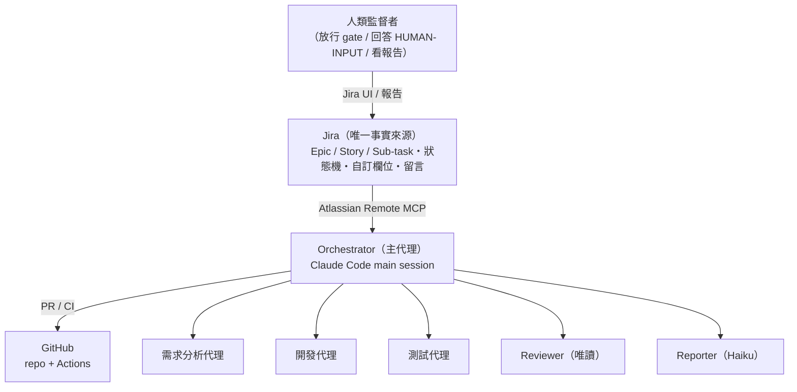
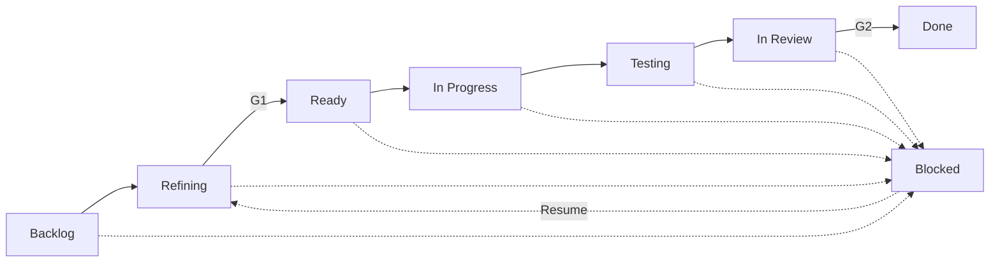
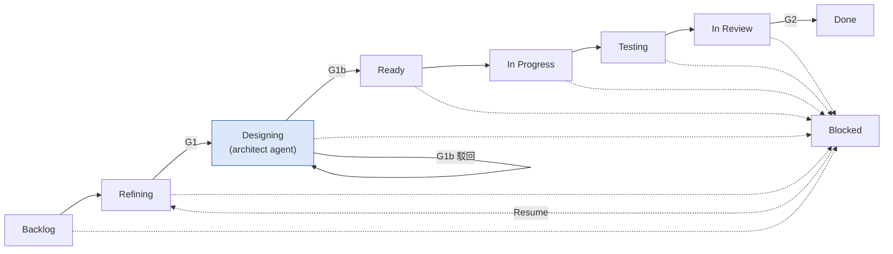
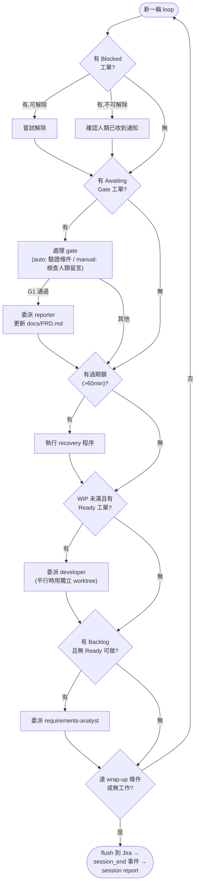

# 08 — 流程圖（Flow Diagrams）

> 本文件是既有文字描述的視覺化補充，不是新規格。狀態機的權威定義仍是
> `docs/02-sdlc-workflow.md`（核心）與各模組的 `module.yaml`（模組擴充）；
> 這裡的圖若與文字描述不一致，以文字描述為準，並回頭修正本文件。

## 1. 系統協調拓樸（原圖，未變動）

> 對應 `docs/01-architecture.md` §1。畫的是「誰跟誰通訊」的靜態拓樸，
> 不分核心/模組——orchestrator 委派哪些子代理，取決於當時啟用了哪些模組。

## 2. 核心狀態機（原始設計流程，未變動）

> 對應 `docs/02-sdlc-workflow.md` §2。**這是框架 v1 的核心骨架**——刻意
> 最小化，只有需求→開發→測試→Review 四段，任何模組都不能修改這張圖本身，
> 只能透過 hook「插入」新階段（見下一節）。

## 3. 擴充後的完整流程（核心 + architecture 模組）

> 這張圖疊加了 `modules/architecture/`（已實作、CMS-AIPilot 已啟用）帶入的
> `Designing` 階段與 `G1b` gate，對應 `modules/architecture/module.yaml` 的
> `hooks: post_ready → insert_stage`。**這是模組啟用後"實際跑的"流程**，
> 跟第 2 節的原始核心流程是兩回事——原始流程沒有消失，是被模組在
> `post_ready` 這個掛勾點插入了新階段。若停用 architecture 模組，流程會
> 回到第 2 節的樣子。

差異對照（相對於第 2 節原始流程）：

| 項目 | 核心（無模組） | + architecture 模組 |
|---|---|---|
| G1 放行後去哪 | 直接進 `Ready` | 先進 `Designing` |
| 新增 gate | 無 | `G1b`（Designing → Ready，manual） |
| 新增 agent | 無 | `architect`（見 `modules/architecture/agents/architect.md`） |
| developer 的輸入 | 需求規格 | 需求規格 + `docs/design/<KEY>.md` |
| reviewer 的輸入 | 需求規格 + PR diff | + `docs/design/<KEY>.md`（checklist 新增「Design conformance」段） |

## 4. Orchestrator 主迴圈（每個 session 的執行順序）

> 對應 `.claude/CLAUDE.md`「Main loop priority order」，目前只以文字列表
> 存在，這裡做成流程圖方便理解實際跑起來的優先序。**這是單一 session
> 一輪 loop 內部的決策順序，不是狀態機**——每一輪都會重新從第 1 步跑起，
> 直到沒有工作或觸發 wrap-up 條件。

## 5. 圖表維護規則

- 這些圖是文字文件的**衍生品**，不是額外規格來源。修改流程時，先改
  `docs/02-sdlc-workflow.md` 或對應模組的 `module.yaml`，再回來同步圖。
- 新模組若插入新階段（`hook: post_ready|pre_refine|post_done|on_blocked`
  的 `insert_stage`），比照第 3 節的做法，在本檔追加一節「核心 + 該模組」
  的疊加圖，**不要修改第 2 節的原始核心圖**——原始圖是理解「拿掉所有模組
  之後框架長什麼樣子」的基準線，必須保持不變。
